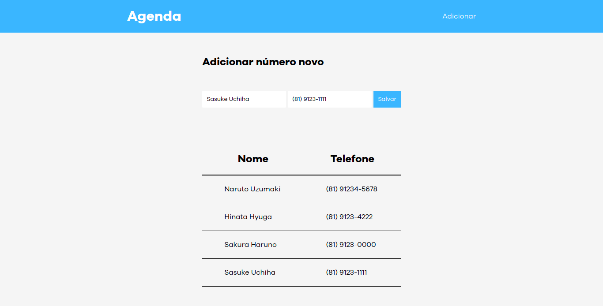

# ebac-projeto-agenda

This repository just was created to conclued a module of Fronted in [EBAC Course](https://ebaconline.com.br/front-end-profession).

## About project

Final Project of Module 8. The purpose of the project is to put into practice what was taught throughout the HTML, CSS and JS modules.

